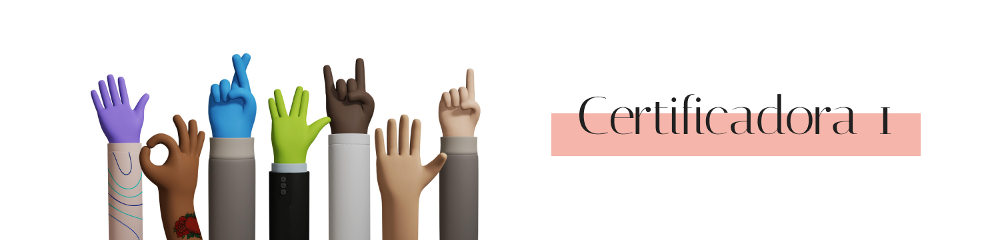

# Certificadora 1 (em desenvolvimento)



<br>

Este projeto será composto pelo desenvolvimento de um sistema web com o objetivo de auxiliar no ensino-aprendizagem de Física, podendo ser utilizado por docentes e discentes do Ensino Médio.

❗ Vídeo de apresentação parcial do projeto: [link](https://drive.google.com/file/d/1lD7Bdwz3aVLJGXDZiy6gxUNpux3Zuswe/view?usp=sharing)

<br>

## 🗳️ Repositório

O repositório contendo o código deste projeto pode ser acessado através deste [link](https://github.com/g-lieira/certificadora-1.git).

<br>


## 🔑 Credenciais para login

Para acessar a página do sistema é necessário que o usuário realize seu login através da inserção de dados nos campos disponíveis: user e e-mail. 
Assim, segue abaixo as credenciais criadas para que seja testado essa funcionalidade:

- User: user
- E-mail: user@email.com

<br>

## 👨‍💻 Equipe

- Gabriela Maria Lieira

- Gabrielle Avelino Saad do Bonfim

- Felipe Kauã de Lima

- Fernando Lima Fernandes

- Talita Aya Sakamoto Kuriki

<br>

## 📑 Requisitos

1. Pesquisar, selecionar e armazenar os 10 problemas de Física do ensino médio, com diferentes níveis de dificuldade (intervalo de 1 a 3); ✅

2. Permitir a navegação entre menus (caso exista mais de um); ✅

3. Listar os problemas armazenados indicando o nível de dificuldade; ✅

4. Alterar a ordenação dos problemas por nível de dificuldade tanto de modo ascendente como descendente; ✅

5. Escolher um problema a ser resolvido: ✅

  
    > Avisar o usuário se o problema escolhido já foi resolvido anteriormente, caso já tenha sido resolvido, perguntar se deseja resolver novamente;

  

6. Permitir ao usuário a inserção dos dados de entrada e a saída calculada do exercício em questão; ✅

7. Apresentar o resultado (saída correta) e comparar com o valor inserido pelo usuário, indicando se o usuário acertou ou errou a resolução; ✅

8. Permitir a consulta de problemas que já foram resolvidos pelo usuário; 

9. Alterar o nível de dificuldade de um problema já resolvido;

10. Exibir a pontuação atual do usuário.

  
<br> 

## 📝 Regras:

- O usuário pode resolver um problema com nível de dificuldade 2 após resolver pelo menos um problema do nível 1;

- O usuário pode resolver um problema do nível 3 após resolver pelo menos um problema do nível 2;

- Após resolver um problema 3, o usuário poderá resolver quaisquer problemas;

- O usuário irá acumular uma pontuação durante a resolução dos problemas;

- Para cada acerto de problemas do nível 1 o usuário recebe 100 pontos;

- Para cada acerto de problemas do nível 2 o usuário recebe 250 pontos;

- Para cada acerto de problemas do nível 3 o usuário recebe 500 pontos;

- Caso o usuário escolha um problema que já foi resolvido a cada nova tentativa a pontuação do problema é dividida por 2.

  
  
<br>

## 💻 Desenvolvimento:

Para a implementação do projeto a equipe utilizará estruturas de dados para desenvolvimento de determinadas funcionalidades, estas que serão listadas após a finalização completa do código.

  

Ademais, optou-se por utilizar [React JS](https://pt-br.legacy.reactjs.org) para construção, Front-end, da aplicação para melhor experiência do usuário, juntamente com a biblioteca [Material UI](https://mui.com), a qual oferece diferentes componentes que auxiliaram na construção das interfaces do sistema, e com o [React Router](https://www.w3schools.com/react/react_router.asp) para controle de rotas e desenvolvimento de uma aplicação padrão SPA (Single Page Application).

  

Para a lógica do projeto foi utilizado o BaaS (Backend As A Service) [Firebase](https://firebase.google.com/products-build?hl=pt), um modelo de serviço que oferece a infraestrutura e o back-end de uma aplicação de forma simplificada.

  

Já o progresso do projeto foi acompanhado através de uma [Planilha Gantt](https://blog.runrun.it/planilha-de-gantt/#:~:text=O%20gr%C3%A1fico%20de%20gantt%20%C3%A9,a%20produtividade%20da%20sua%20%C3%A1rea.), contendo os status de todas as tarefas pendentes, os responsáveis, datas de início e fim, bem como estregas parciais e finais. Este cronograma completo pode ser visualizado através deste [link](https://docs.google.com/spreadsheets/d/1Jwyi7Cnf9VErxFQGkgOChjM9Tt3gh-hD/edit?usp=sharing&ouid=112152257061659035144&rtpof=true&sd=true).

  
<br>

## 🎨 Design:

A interface do projeto foi desenvolvida utilizando a ferramenta [Figma](https://www.google.com/url?sa=t&rct=j&q=&esrc=s&source=web&cd=&ved=2ahUKEwitvZDQr7mBAxUepZUCHXgoBgIQFnoECAcQAQ&url=https://www.figma.com/&usg=AOvVaw2ixWJnr7CgjXMg3QXfTz4u&opi=89978449), esta que permitiu criar um arquivo compartilhável e um protótipo do que seria desenvolvido, facilitando o entendimento geral, certificando que todos os requisitos e regras seriam seguidos e permitindo a estilização do sistema para uma interface amigável.

  

Deste modo, o design pode ser acessado através deste [link](https://www.figma.com/file/kZ44UuZdTcbT0G1RFguGDa/Certificadora-1?type=design&node-id=1:6&mode=design&t=iHhLfTl6GlP6icbT-1).

  
  
<br>

## 📥 Instalação e execução

1. Clonar o projeto em seu próprio computador

```
//git clone <link do repositório>

git clone https://github.com/g-lieira/certificadora-1.git
```
2. Abrir a pasta do projeto em seu editor de código


3. Instalar todas as dependências do projeto

    3.1. Esta etapa pode ser feita no terminal do projeto

        Ex: No Visual Studio Code basta utilizar o atalho Ctrl + J

```
npm install --global yarn

//após a conclusão do comando acima seguir a execução do próximo:

yarn
```

4. Rodar os arquivos

```
yarn start
```


O sistema será aberto em uma nova página de seu navegador, sendo possível o uso da aplicação e suas funcionalidades.
